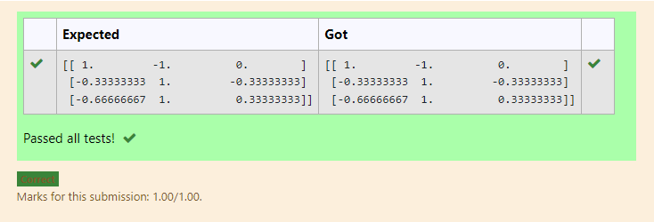

# INVERSE-OF-A-MATRIX
## Aim:
To write a python program to find the inverse of a matrix
## Equipment’s required:
1. 	Hardware – PCs
2. 	Anaconda – Python 3.7 Installation / Moodle-Code Runner
## Algorithm:
### Step1 :
Import numpy library using import statement. 
### Step 2: 
Using np.array(), create an array for the given matrix.
### Step 3: 
Using the np.linalg.inv(), we can find the inverse of the given matrix.
### Step 4: 
Print the result and end the program.

## Program:
~~~
#Program to find the inverse of a matrix.
#Developed by: SRIJITH R
#RegisterNumber: 21004191
import numpy as np
a=np.array([[2,1,1],[1,1,1,],[1,-1,2]])
values=np.linalg.inv(a)
print(values)
~~~
## Output:

## Result:
Thus the inverse of given matrix is successfully solved using python program

